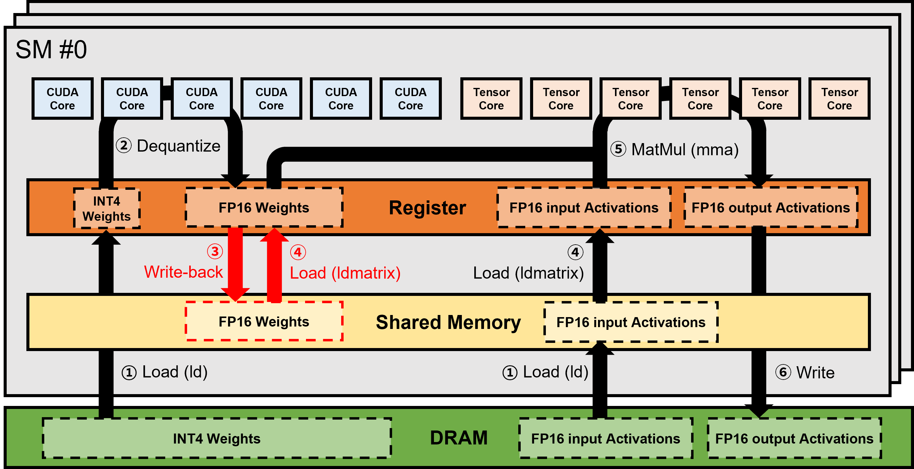
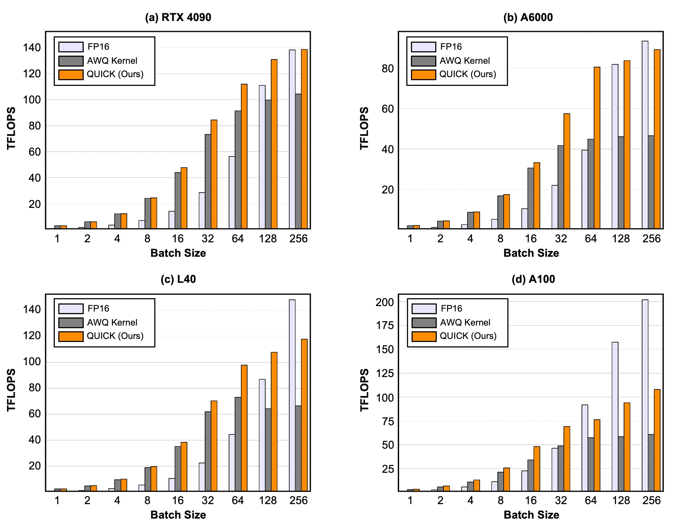
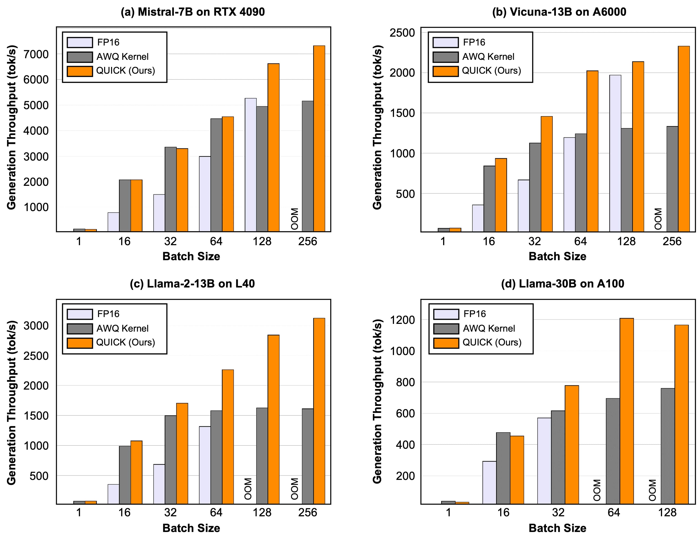

# QUICK: Quantization-aware Interleaving and Conflict-free Kernel for efficient LLM inference

<p align="middle">
    <a href="https://github.com/Squeezebits/QUICK/releases"></a>
    <a href="https://arxiv.org/abs/2402.10076"></a>
</p>

Introducing [QUICK](https://arxiv.org/abs/2402.10076), a collection of novel optimized CUDA kernels designed for faster inference of quantized Large Language Models (LLMs). QUICK addresses the shared memory write-back bank conflict issue in state-of-the-art mixed precision General Matrix Multiplication (GEMM) kernels.

​​​

### 🏎️ Why QUICK?

- QUICK introduces a replacement for mixed precision GEMM kernels tailored for weight-only quantized LLMs.
- AWQ-QUICK kernel achieves a throughput gain of up to 1.91x over existing mixed precision GEMM kernels, resulting in up to 1.94x throughput gain on representative quantized LLMs.
- QUICK draws inspiration from and builds upon the <a href="https://github.com/mit-han-lab/llm-awq">original work</a> by MIT and the <a href="https://github.com/casper-hansen/AutoAWQ">AutoAWQ package</a>.

### 📝 About QUICK

QUICK eliminates shared memory write-back bank conflicts introduced in previous mixed precision GEMM kernels.

The bank conflicts arise when the dequantized weights are written back to shared memory for subsequent computations. Consequently, bank conflicts induce a significant number of stalls, thereby deteriorating the overall throughput of mixed precision GEMM, especially for workloads with large batches.

QUICK rearranges the quantized weight matrix offline to remove the bank conflicts effectively. This rearrangement aligns with the load and computation pattern of Tensor Cores in NVIDIA GPUs without the need for shared memory write-back.

## 🚀 Install

### 📖 Prerequisites

- Your GPU(s) need to have a Compute Capability of 7.5 or higher. QUICK is currently best optimized to the Ampere architecture.
- To install this package, please use CUDA 11.8 or higher.
- For optimal performance, the inference of LLMs requires additional optimized CUDA kernels for layers like layernorm and fused multi-head attention. Currently, QUICK is solely focused on improving mixed precision GEMM operations and does not include such kernels. Therefore, please install the <a href="https://github.com/casper-hansen/AutoAWQ_kernels">AutoAWQ_kernels</a> package for such layers.

### 🏗️ Build from source
- Build from the master branch (Recommended):
```
pip install git+https://github.com/SqueezeBits/QUICK
```
- Or clone the repository and install from source:
```
git clone https://github.com/SqueezeBits/QUICK
cd QUICK
pip install -e .
```

## 🔍  Usage


1. Quantization: Perform AWQ with our kernel(QUICK) or original AWQ kernel(GEMM) 
```
python examples/basic_quant.py --model_path </path/to/hf-model> --quant_path </path/to/save/quant-model>  --version <QUICK or GEMM>
```


2. Evaluation: Evaluate the quantized model on several tasks (we tested on 'wikitext' dataset)
```
python examples/eval.py --model_path </path/to/quant-model> --tasks <tasks_to_evaluate>
```

3. Benchmark: You can check the end-to-end benchmark data we attached below on your machine.
```
python examples/benchmark.py --model_path </path/to/quant-model> --batch_size N
```


Below is an example for the simplest use of auto_awq with QUICK to quantize a model and inference after quantization:

<details>

<summary>Quantization & Inference</summary>

Expect this to take 10-15 minutes on smaller 7B models, and around 1 hour for 70B models.

```python
from quick.awq import AutoAWQForCausalLM
from transformers import AutoTokenizer, TextStreamer

model_path = 'mistralai/Mistral-7B-v0.1'
quant_path = 'Mistral-7B-v0.1-awq-QUICK'
quant_config = { "zero_point": True, "q_group_size": 128, "w_bit": 4, "version": "QUICK" }

# Load model
model = AutoAWQForCausalLM.from_pretrained(model_path)
tokenizer = AutoTokenizer.from_pretrained(model_path, trust_remote_code=True)
streamer = TextStreamer(tokenizer, skip_prompt=True, skip_special_tokens=True)

# Quantize
model.quantize(tokenizer, quant_config=quant_config)

# Save quantized model
model.save_quantized(quant_path)
tokenizer.save_pretrained(quant_path)

# Convert prompt to tokens
prompt_template = "[INST] {prompt} [/INST]"

# prompt = "Explain quantum physics to a five-year-old using only metaphors."
prompt = "What is the birth year of Albert Einstein?"\
        "and what famous equation is Albert Einstein known for?"

tokens = tokenizer(
    prompt_template.format(prompt=prompt), 
    return_tensors='pt'
).input_ids.cuda()

# Generate output
generation_output = model.generate(
    tokens, 
    streamer=streamer,
    max_new_tokens=512
)
```

</details>


## 📊 Benchmarks

These benchmarks highlight the improvement in both single mixed precision GEMM throughput and inference throughput of weight-only quantized LLMs. The results include measurements in Tera Operations per Second (TOPS) for single matrix multiplications across various M sizes, considering a matrix multiplication workload with a shape of (M x K x N), conducted on multiple GPU devices. Additionally, the benchmarks demonstrate the token generation throughput gain of representative weight-only quantized LLMs across diverse GPU devices. In the end-to-end benchmarks, we fixed the prefill length and decode length to 128 each in order to test various batch sizes on single GPUs.

To ensure fairness in testing, we used the same benchmark script in AutoAWQ. Notably, we observed that the perplexity of quantized LLMs remains consistent compared to AutoAWQ when using QUICK. It's important to note that benchmark data may vary across different GPUs and CPUs, as well as among different inference frameworks.


### 📈 Kernel benchmarks

​ 
- Workload shape: M x 8192 x 8192 (M x K x N)

<div align="center">

| Device   | Batch Size | FP16 (TFLOPS) | AWQ (TFLOPS) | QUICK (TFLOPS) | Speedup-FP16 | Speedup-AWQ |
|----------|------------|---------------|--------------|----------------|--------------|-------------|
| RTX 4090 | 1          | 0.8           | 3.11         | 3.12           | 290%         | 0%          |
|  | 64         | 56.4          | 91.39        | 111.99         | 99%          | 23%         |
|  | 128        | 138.2         | 104.36       | 138.59         | 0%           | 33%         |
| A6000    | 1          | 0.7           | 2.21         | 2.28           | 226%         | 3%          |
|     | 64         | 39.4          | 44.85        | 80.42          | 104%         | 79%         |
|     | 128        | 81.7          | 46.05        | 83.62          | 2%           | 82%         |
| L40      | 1          | 0.7           | 2.41         | 2.51           | 259%         | 4%          |
|       | 64         | 44.4          | 72.9         | 97.73          | 120%         | 34%         |
|       | 128        | 148           | 64.28        | 107.67         | -27%         | 68%         |
| A100     | 1          | 1.4           | 2.94         | 3.52           | 151%         | 20%         |
|      | 16         | 22.6          | 34.23        | 48.14          | 113%         | 41%         |
|      | 32         | 46.4          | 48.83        | 69.03          | 49%          | 41%         |
|      | 64         | 91.9          | 57.43        | 76.31          | -17%         | 33%         |
|      | 128        | 157.4         | 58.46        | 94.03          | -40%         | 61%         |

</div>

_"Speedup-FP16/AWQ" means the extent to which QUICK has become faster compared to FP16/AWQ kenel._

### 📈 End-to-end benchmarks

​

<center>

| Model       | Device   | Batch Size | FP16 (tok/s) | AWQ (tok/s) | QUICK (tok/s) | Speedup-FP16 | Speedup-AWQ |
|-------------|----------|------------|--------------|-------------|---------------|--------------|-------------|
| Mistral-7B  | RTX 4090 | 1          | 52.8         | 154.0       | 137.3         | 160%         | -11%        |
|             |          | 64         | 2985.6       | 4465.9      | 4539.8        | 52%          | 2%          |
|             |          | 256        | OOM          | 5156.9      | 7316.9        | -            | 42%         |
| Vicuna-13B  | A6000    | 1          | 23.6         | 65.0        | 68.5          | 191%         | 5%          |
|             |          | 64         | 1194.0       | 1241.3      | 2023.4        | 69%          | 63%         |
|             |          | 256        | OOM          | 1332.1      | 2330.2        | -            | 75%         |
| Llama-2-13B | L40      | 1          | 23.5         | 70.2        | 72.5          | 208%         | 3%          |
|             |          | 64         | 1315.2       | 1580.4      | 2262.4        | 72%          | 43%         |
|             |          | 256        | OOM          | 1611.3      | 3122.4        | -            | 94%         |
| Llama-30B   | A100     | 1          | 20.0         | 36.7        | 31.1          | 55%          | -15%        |
|             |          | 64         | OOM          | 695.2       | 1207.9        | -            | 74%         |
|             |          | 128        | OOM          | 759.4       | 1165.2        | -            | 53%         |

</center>

### 📈 vLLM benchmarks

We are actively working on the integration of QUICK into widely-used LLM frameworks. In this section, we present the throughput benchmark results of our initial version of <a href="https://github.com/vllm-project/vllm">vLLM</a> integrated with QUICK.

<div align="center">

| Model       | FP16 (tok/s) | AWQ (tok/s) | QUICK (tok/s) | Speedup-FP16 | Speedup-AWQ |
|-------------|--------------|-------------|---------------|--------------|-------------|
| Vicuna-13B  | 985.2        | 1030.4      | 1308.6        | 33%          | 27%         |
| Llama-2-70B | OOM          | 224.3       | 290.2         | -            | 29%         |

</div>

- _Throughput was evaluated using the <a href="https://github.com/vllm-project/vllm/blob/main/benchmarks/benchmark_throughput.py">benchmark_throughput</a> script within vLLM._
- _ShareGPT_V3_unfiltered_cleaned_split dataset was used as the workload._
- _The benchmarks were conducted on a system equipped with an i9-13900K CPU, 128GB RAM, and an A6000 GPU._
- _"Speedup-FP16/AWQ" means the extent to which QUICK has shown higher throughput compared to FP16/AWQ kernel._

## 🙋‍♂️ Frequently Asked Questions

<details>
<summary>Inference fails due to the absence of the layernorm kernel.</summary>

- Currently, for the optimized CUDA kernels of various layers like layernorm and fused multi-head attention layers, QUICK requires the installation of the <a href="https://github.com/casper-hansen/AutoAWQ_kernels/releases">AutoAWQ_kernels</a> package. Please proceed to install the package using the provided link.

</details>

## 📚 Cite

If you find our code or QUICK useful for your research, please consider citing:
```
@misc{kim2024quick,
      title={QUICK: Quantization-aware Interleaving and Conflict-free Kernel for efficient LLM inference}, 
      author={Taesu Kim and Jongho Lee and Daehyun Ahn and Sarang Kim and Jiwoong Choi and Minkyu Kim and Hyungjun Kim},
      year={2024},
      eprint={2402.10076},
      archivePrefix={arXiv},
      primaryClass={cs.LG}
}
```
